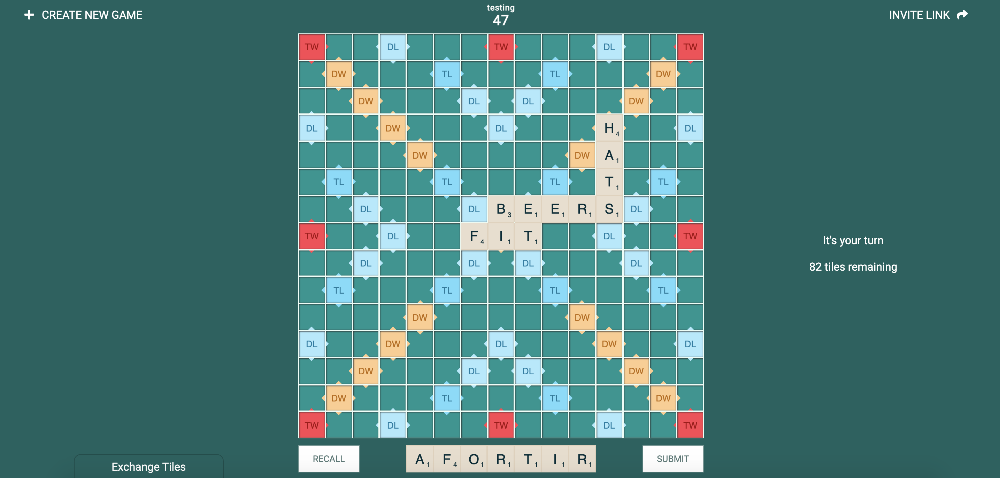

# Scrabble

I couldn't find a decent free online version, so decided to make one. Written as
a [Next.js](https://nextjs.org/) application, backed by [Firebase](https://firebase.google.com/)
and deployed with [Vercel](https://vercel.com/). Just a little pet project to
keep me occupied during Covid-19 times.

[**Play here**](https://scrabble-mu.vercel.app/)



---

SCRABBLE® is a registered trademark. All intellectual property rights in and to
the game are owned in the U.S.A and Canada by Hasbro Inc., and throughout the
rest of the world by J.W. Spear & Sons Limited of Maidenhead, Berkshire, England,
a subsidiary of Mattel Inc.

---

## Development

To run the application locally you will need to setup a (free) Firebase project.

- Create a [new Firebase project](https://console.firebase.google.com/)
and [register a web app](https://firebase.google.com/docs/web/setup#register-app).
- Copy the Firebase config object to the root of this repo as `firebase-web-config.json`, for example:

```json
{
  "apiKey": "<your-api-key>",
  "authDomain": "<your-auth-domain>",
  "projectId": "<your-project-id>",
  "storageBucket": "<your-storage-bucket>",
  "messagingSenderId": "<your-message-sender-id>",
  "appId": "<your-app-id>"
};
```

- Enable [email link (passwordless sign-in) authentication](https://firebase.google.com/docs/auth/web/email-link-auth).
- Provision a [Cloud Firestore](https://firebase.google.com/docs/firestore/quickstart) database.
- [Generate a private key](https://firebase.google.com/docs/admin/setup#initialize-sdk),
copy the JSON file to the root of the repo and rename to `private-key.json`.
- Run `firebase use --add` and select your project (choose any alias you like).
- Run `yarn firebase deploy --only firestore:rules` to apply the database riles.

You should now be able to bring the application up with `yarn dev` and visit it
at http://localhost:3000.

Note that if you want to hit the application at `127.0.0.1` instead you will
need to whitelist the domain in the Firebase console.
